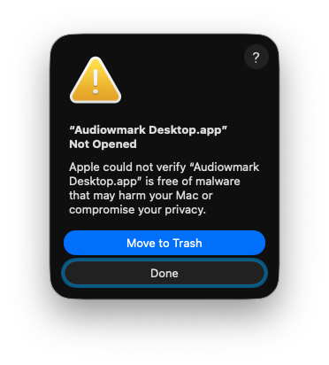
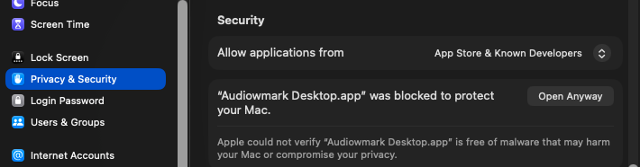

# Audiowmark Desktop

A PyQt6 desktop GUI for [audiowmark](https://github.com/swesterfeld/audiowmark) - the robust audio watermarking tool by Stefan Westerfeld.

Embeds invisible, cryptographically secured watermarks into audio files. The watermark survives MP3/OGG re-encoding at 128 kbit/s or higher and can be detected from a copy without the original file.

## Features

- **Add Watermark** - embed a watermark into WAV, MP3, or FLAC files with configurable strength
- **Get Watermark** - decode and verify watermarks; all keys in your key directory are tried automatically
- **Key Management** - generate and manage audiowmark keys and HMAC secrets
- **Cryptographic payload** - metadata (copyright, artist, title, purpose) is never stored directly in the audio; only its HMAC-SHA256 hash is embedded, making it one-way and unforgeable
- **Database** - maps payload hashes back to metadata for verified decoding
- **MP3 input** - MP3 files are decoded to a temporary WAV via ffmpeg before processing, working around libmpg123 frame-count limitations that would otherwise cause truncated output
- **MP3 output and format conversion** - output format is independent of input format; WAV, MP3, FLAC, and AIFF are all supported as output; MP3 output is re-encoded by ffmpeg at the original bitrate after watermarking
- **Metadata preservation** - audio tags (title, artist, album, genre, year, composer, comment, etc.) are copied from the input file to the output, across all supported formats (WAV RIFF INFO, MP3 ID3, FLAC Vorbis comments)
- **Cover art preservation** - embedded album art is carried through to the output without re-encoding
- **Key rotation** - multiple keys supported; all are tried automatically on decode


## Security model

| Property                                | This tool                            |
| --------------------------------------- | ------------------------------------ |
| Payload readable without key            | No - private audiowmark key required |
| Payload forgeable                       | No - HMAC secret required            |
| Watermark removable losslessly          | No - private audiowmark key required |
| Metadata recoverable from payload alone | No - one-way HMAC                    |
| Multiple key rotation                   | Yes                                  |

## Usage

1. Go to **Key Management**, choose a keys directory, and generate at least one audiowmark key and one HMAC secret.
2. In **Add Watermark**, select your input file, fill in the metadata fields (Copyright is mandatory), choose a key and secret, and click *Add Watermark*.
3. In **Get Watermark**, select a watermarked file - all keys are tried automatically and the matching metadata is displayed.

### Watermark strength reference

| Strength       | Use case                                       |
| -------------- | ---------------------------------------------- |
| 10.0 (default) | Survives MP3/OGG at 128 kbit/s+ - good balance |
| 13.0 – 15.0    | Multiple conversions, low bitrate (64 kbit/s)  |
| 15.0 – 20.0    | Maximum robustness; slight audibility possible |

## Installation

### macOS - via .dmg (recommended)

Download the matching `.dmg` for your Mac from the [Releases](../../releases) page, open it, and drag **Audiowmark Desktop** into the Applications folder.

| File | Runs on |
| ---- | ------- |
| `audiowmark-desktop_<version>_macos_arm64.dmg` | Apple Silicon (M1 and later), native |
| `audiowmark-desktop_<version>_macos_x86_64.dmg` | Intel Macs, native; Apple Silicon via Rosetta 2 |

- Requires macOS 14 (Sonoma) or later
- `audiowmark` and `ffmpeg` are bundled - no separate installation needed

> **Note:** The app is not notarized, as Apple requires a paid ($99/year) developer account for this.
> On first launch macOS may show "app is damaged". There are two ways to fix this:
>
> **Option 1 - Terminal** (quickest): run once to clear the quarantine flag:
> ```bash
> xattr -rd com.apple.quarantine "/Applications/Audiowmark Desktop.app"
> ```
>
> **Option 2 - System Settings:** if macOS shows this dialog:
>
> 
>
> Click *Done*, then open **System Settings - Privacy & Security** and click **Open Anyway**:
>
> 
>
> Then confirm with **Open Anyway** once more.

### Linux - via .deb package (recommended)

Download the latest `.deb` for your architecture from the [Releases](../../releases) page:

```bash
sudo apt install ./audiowmark-desktop_<version>_amd64.deb
# or for ARM:
sudo apt install ./audiowmark-desktop_<version>_arm64.deb
```

The package bundles a compiled `audiowmark` binary - no separate installation needed.

**Optional:** install `ffmpeg` and `ffprobe` for MP3 input/output support and metadata/cover art preservation:

```bash
sudo apt install ffmpeg
```

## Building from source

**Requirements:**

- Python 3.8+
- PyQt6 (`pip install pyqt6`)
- [audiowmark](https://github.com/swesterfeld/audiowmark) in `$PATH`
- ffmpeg + ffprobe (optional, for MP3 input/output and metadata/cover art preservation)

```bash
git clone https://github.com/huddx01/audiowmark-desktop.git
cd audiowmark-desktop
pip install pyqt6
python3 src/audiowmark_gui.py
```

## Building locally

### macOS .dmg

```bash
bash packaging/build_mac.sh 1.0.0
# output: dist/audiowmark-desktop_1.0.0_macos_arm64.dmg   (on Apple Silicon)
#         dist/audiowmark-desktop_1.0.0_macos_x86_64.dmg  (on Intel)
```

Homebrew, Python, PyQt6, PyInstaller, and all native dependencies are installed automatically by the script.

### Linux .deb

```bash
sudo apt-get install autoconf automake libtool pkg-config \
  libsndfile1-dev libmpg123-dev libzita-resampler-dev \
  libfftw3-dev libgcrypt20-dev \
  libavcodec-dev libavformat-dev libavutil-dev libswresample-dev \
  zstd fakeroot

bash packaging/build_deb.sh 1.0.0
# output: dist/audiowmark-desktop_1.0.0_amd64.deb
```

## License

Copyright © 2026 [Sojuzstudio](https://github.com/Sojuzstudio), [huddx01](https://github.com/huddx01).

This program is free software: you can redistribute it and/or modify it under the terms of the GNU General Public License as published by the Free Software Foundation, either version 3 of the License, or (at your option) any later version.

See [LICENSE](LICENSE) for the full text.

audiowmark itself is © Stefan Westerfeld, licensed under the LGPL v2.1+.
